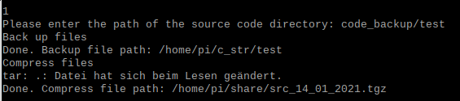
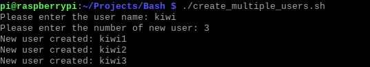
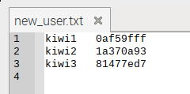

# Bash scripting (2020)

A series of bash scripts. It has the following functions:

1.	Backup source code
2.  Unzip und classify files
3.  Display usage
4.  Create multiple users


## Installation
```
git clone https://github.com/xuanjiao/Bash_scripting.git
```

## Usage
1.  Run the script

```
pi@raspberrypi:~/Projects/Bash $ ./run.sh

*************************************************
* 1.	Backup Source code
* 2.	Unzip and classify file
* 3.	Display disk and memory usage
* 4.	Create multiple users
* 5.	Query for database
* q.	Quit
*************************************************

```

2.  Type the option number. The following are instructions for all options:


### 1.	Backup source code
Backup and compress files in a path



### 2.  Unzip und classify files
* **Unzip:** unzip test.tar.gz. 
* **Classify:** Copy all c files to the "c_dir" directory and all headle files into the "h_dir" directory.
* **Info:** Create a text file "dirinfo.txt" and list all c and headle files, count files.

### 3. Display usage

Showing the percentages of memory, disk and CPU used on the machine


### 4. Create multiple users
Create multiple users with random password, and then save the user name and passsword to a text file.





### 5. SQL Query
Query for exployee information in the database

```
5
Please enter the employee's name: James Smith
Please enter the database password: pi
employees
+--------+------------+------------+-----------+--------+------------+
| emp_no | birth_date | first_name | last_name | gender | hire_date  |
+--------+------------+------------+-----------+--------+------------+
|  10001 | 1970-01-23 | James      | Smith     | M      | 2020-06-26 |
+--------+------------+------------+-----------+--------+------------+
```

If database not exist
```
5
Please enter the employee's name: James Smith
Please enter the database password: pi
Database employees not exists. Create database.
+--------+------------+------------+-----------+--------+------------+
| emp_no | birth_date | first_name | last_name | gender | hire_date  |
+--------+------------+------------+-----------+--------+------------+
|  10001 | 1970-01-23 | James      | Smith     | M      | 2020-06-26 |
+--------+------------+------------+-----------+--------+------------+
```
